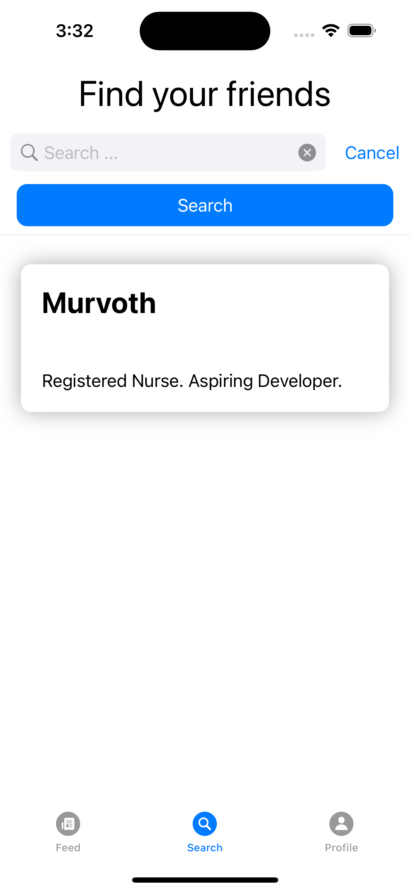

# vibely-ios

Vibely is all about the good Vibes. A new social media feed that focuses around your circle and lets you decide if something was a vibe or...NOT A VIBE!

## Background and Concept

We wanted to create a new social media app that got rid of some of the clutter of others. Instead of bombarding you with politics, current events and devisive posts we want you to be abel to see posts that are fun and related to your circle. You can then decide if someones post is NOT A VIBE!

## Links

The GitHub repo and deployed links for the web version of the Vibely app built as a group project at the end of my bootcamp.

[Vibely Repo](https://github.com/MattGaarder/vibely)

[Vibely Web](https://endearing-sundae-33b843.netlify.app/#/signup)

## Gallery

 
